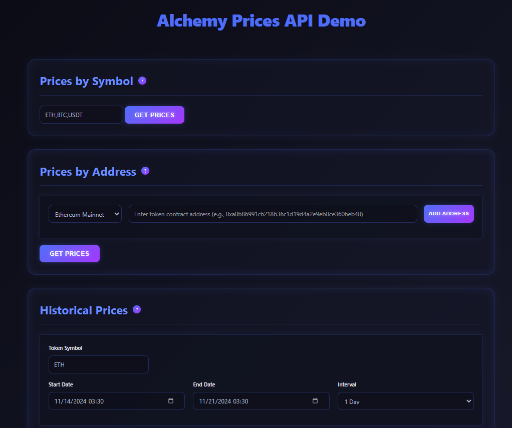

# Alchemy Prices API Demo

A modern web application demonstrating the usage of Alchemy's Price API endpoints for cryptocurrency price tracking and historical data analysis.



🌐 [Live Demo](https://alchemy-prices-api.vercel.app)

## Features

- **Price by Symbol**: Get current prices for multiple cryptocurrencies using their symbols
- **Price by Address**: Fetch token prices using their contract addresses across different networks
  - Supports Ethereum, Polygon, and Arbitrum networks
  - Includes USDC contract address example (0xA0b86991c6218b36c1d19D4a2e9Eb0cE3606eB48)
- **Historical Prices**: View historical price data with customizable time ranges and intervals

## Technologies Used

- **Frontend**:
  - HTML5
  - CSS3 (with modern features like CSS Variables, Flexbox, and Grid)
  - JavaScript (ES6+)
  - Custom UI components with neon/cyberpunk theme

- **Backend**:
  - Node.js
  - Express.js
  - Vercel Serverless Functions
  - node-fetch for API requests

- **APIs**:
  - Alchemy Price API
    - Token Prices By Symbol
    - Token Prices By Address
    - Historical Token Prices

## Prerequisites

- Node.js (v14 or higher)
- npm (Node Package Manager)
- Alchemy API Key

## Local Development

1. Clone the repository: 
```bash
git clone https://github.com/gabriel-dg/alchemy-prices-api
cd alchemy-prices-api
```

2. Install dependencies:
```bash
npm install
```

3. Create a `.env` file in the root directory and add your Alchemy API key:
```bash
ALCHEMY_API_KEY=your_alchemy_api_key_here
```

4. Start the development server:
```bash
npm run dev
```

5. Open your browser and navigate to `http://localhost:3000`

## Project Structure

```
alchemy-prices-api/
├── api/
│   └── index.js          # Serverless API endpoints
├── public/
│   ├── index.html        # Main HTML file
│   ├── styles.css        # Styles with neon theme
│   └── app.js           # Frontend JavaScript
├── vercel.json          # Vercel configuration
├── package.json
├── .env
└── README.md
```

## Features in Detail

### 1. Prices by Symbol
- Get current prices for multiple tokens using their symbols
- Support for comma-separated symbols (e.g., "BTC,ETH,USDT")
- Displays price and last update time

### 2. Prices by Address
- Fetch token prices using contract addresses
- Support for multiple networks (Ethereum, Polygon, Arbitrum)
- Includes example USDC contract address
- Dynamic address list management with add/remove functionality

### 3. Historical Prices
- View historical price data for any token
- Customizable date range selection
- Multiple interval options (1h, 1d, 1w)
- Paginated results with 10 entries per page

## Deployment

This project is deployed on Vercel. To deploy your own instance:

1. Fork this repository
2. Create a Vercel account
3. Import your forked repository
4. Add your `ALCHEMY_API_KEY` to the environment variables
5. Deploy!

## Contributing

1. Fork the repository
2. Create your feature branch (`git checkout -b feature/AmazingFeature`)
3. Commit your changes (`git commit -m 'Add some AmazingFeature'`)
4. Push to the branch (`git push origin feature/AmazingFeature`)
5. Open a Pull Request

## License

This project is licensed under the MIT License - see the [LICENSE](LICENSE) file for details.

## Acknowledgments

- [Alchemy](https://www.alchemy.com/) for providing the Price API
- Vercel for hosting the application


